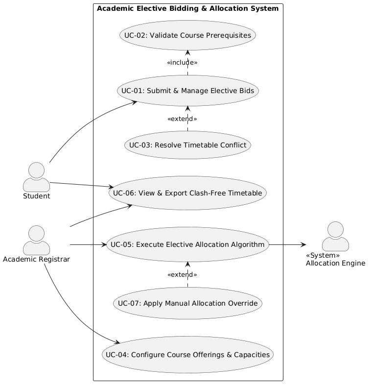

# Problem Statement #05: Academic Elective Bidding & Allocation System
**Course:** PES University - Dept. of CSE | Lab 1: Requirements Engineering & UML Use-Case Modelling  
**Domain:** Campus & Academic Operations  

---

## 1. Complete Requirements Table

| Req ID | Type | Description | Priority | Acceptance Criteria | Rationale (Short Justification) | Comments |
| :--- | :--- | :--- | :---: | :--- | :--- | :--- |
| **FR-001** | Functional | The system shall allow students to distribute 100 bidding credits across their ranked elective preferences and validate prerequisite course completions. | **High** | **Pass:** Credits deduct accurately (sum == 100) and prerequisites validated. **Fail:** Total allocated credits != 100 or unmet prerequisites bypassed. | Core bidding functionality ensuring fair distribution of student preferences according to academic eligibility. | Base requirement from problem statement. |
| **FR-002** | Functional | The system shall allow the Academic Registrar to configure elective course offerings, section capacities (min/max seats), and designated timetable slot constraints. | **High** | **Pass:** Course records saved with designated capacities and slot times. **Fail:** Duplicate slot assignments without multi-section flag or invalid seat caps. | Establishes the boundary conditions and constraints required by the automated allocation solver. | Validates non-negative seat counts and non-overlapping department slots. |
| **FR-003** | Functional | The system shall execute the multi-criteria optimization solver to allocate courses based on bid weightings, CGPA tie-breakers, and room/slot collision avoidance rules. | **High** | **Pass:** All eligible bids evaluated; seats filled up to max limit with 0 timetable clashes. **Fail:** Student assigned to overlapping lecture slots or oversubscribed course. | Core algorithmic automation eliminating manual clash resolution and ensuring objective allocation. | Solver should handle hard constraints (no clash) and soft constraints (preferences). |
| **FR-004** | Functional | The system shall allow students to view real-time provisional seat demand percentages and adjust/reallocate their submitted bidding points prior to the deadline window closure. | **Medium** | **Pass:** Bid updates reflected instantly in student profile and draft pool before lock time. **Fail:** Modifications permitted after deadline timestamp. | Provides transparency on course popularity, allowing students to strategize point allocation dynamically. | Access locked immediately upon bidding window expiry. |
| **FR-005** | Functional | The system shall publish final allocation results, generate individualized clash-free timetables for students, and export master enrollment rosters for the Academic Registrar. | **Medium** | **Pass:** Downloadable PDF/ICS schedule produced with 0 slot clashes; Registrar roster matches allocated student IDs. **Fail:** Incomplete roster export or unassigned enrolled courses. | Closes the registration lifecycle with actionable student schedules and official registrar records. | Supports PDF and Excel/CSV export formats. |
| **NFR-001** | Non-Functional *(Performance)* | The final elective allocation solver shall process 5,000 student bids and resolve schedule conflicts in under 30 seconds. | **High** | **Pass:** Benchmarking tests confirm execution time < 30 seconds for 5,000 concurrent student bids under simulated peak load. **Fail:** Solver execution exceeds 30 seconds or server runs out of memory. | Prevents server bottlenecks and ensures rapid turnaround between bidding closure and timetable publishing. | Benchmark under synthetic 5,000 student dataset with 40 elective offerings. |
| **NFR-002** | Non-Functional *(Security & Integrity)* | The system shall enforce Role-Based Access Control (RBAC) and maintain an immutable audit trail of all bid submissions, modifications, and administrative overrides. | **High** | **Pass:** Unauthorized role access blocked (403 Forbidden); 100% of bid modification events logged with timestamp, user ID, and prior state. **Fail:** Unauthenticated bid injection or unlogged state change. | Guarantees academic integrity, prevents tampering, and ensures auditability during student grievance redressals. | Audit log entries secured with write-once access policies. |

---

## 2. UML Use-Case Diagram

### 2.1 Actors & Use Cases Overview

#### **Actors:**
1. **Student** (Primary Actor - Initiates bidding, manages preferences, views allocations)
2. **Academic Registrar** (Primary Actor - Configures courses, runs solver, reviews rosters, handles overrides)
3. **Timetable & Allocation Engine** (Secondary / Supporting System - Executes constraint satisfaction algorithm)

#### **Use Cases:**
- **UC-01:** Submit & Manage Elective Bids
- **UC-02:** Validate Course Prerequisites (*«include»* in UC-01)
- **UC-03:** Resolve Timetable Conflict (*«extend»* to UC-01)
- **UC-04:** Configure Course Offerings & Capacities
- **UC-05:** Execute Elective Allocation Algorithm
- **UC-06:** View & Export Clash-Free Timetable
- **UC-07:** Apply Manual Allocation Override (*«extend»* to UC-05)

---
### 2.2 UML Use-Case Diagram

---

## 3. Use-Case Flow Specification

### **Use Case: UC-01 — Submit Elective Bids**

| Field | Specification |
| :--- | :--- |
| **Use Case ID** | **UC-01** |
| **Use Case Name** | Submit Elective Bids |
| **Primary Actor** | Student |
| **Secondary Actor(s)**| Academic Database / Prerequisite Validation Service |
| **Priority** | High |
| **Description** | Allows a student to allocate 100 bidding credits across their preferred elective courses, validate prerequisites, and lock their bidding submission for algorithmic allocation. |
| **Preconditions** | 1. Student is authenticated and has an active enrollment status. 2. Elective bidding window is active/open. 3. Student has exactly 100 unspent bidding points available for the semester. |
| **Postconditions** | 1. Student's elective bids and credit allocations are persistently stored. 2. Total credits used are marked as 100. 3. An immutable audit log entry and confirmation receipt are generated. |

#### **Main Success Scenario (Step-by-Step Flow):**
1. **Student** logs into the portal and navigates to the "Elective Course Bidding" section.
2. **System** displays the list of offered elective courses, descriptions, available seats, faculty, and schedule slot timings.
3. **Student** selects up to $N$ elective courses and distributes exactly 100 bidding points among them based on priority.
4. **Student** submits the bidding form by clicking "Submit Bids".
5. **System** invokes `«include»` **UC-02: Validate Course Prerequisites** to check the student's completed credits and course history against course prerequisites.
6. **System** validates that the sum of allocated bidding points is exactly equal to 100.
7. **System** confirms that no two selected electives share mutually exclusive required core slots.
8. **System** commits the bid records into the active allocation pool and generates a transaction timestamp.
9. **System** displays a success message: *"Your elective bids have been successfully recorded with 100 points distributed."* and provides a downloadable/printable confirmation summary.
10. **Use Case ends successfully.**

---

#### **Alternate Flows:**

##### **Flow 4a: Bidding Points Total Mismatch (< 100 or > 100 credits)**
- **4a1.** System checks the sum of distributed credits and detects that $\text{Sum} \neq 100$ (e.g., total = 90 or total = 110).
- **4a2.** System blocks submission and displays an error alert: *"Error: Total allocated points must equal exactly 100 credits. Current Total: [X] credits."*
- **4a3.** System highlights the credit allocation input fields with remaining/excess points counter.
- **4a4.** Student adjusts point values to total 100 and resubmits (re-enters Main Flow at Step 4).

##### **Flow 5a: Unmet Course Prerequisites**
- **5a1.** During prerequisite verification, System detects student has not passed prerequisite Course $P$ for selected Elective $E$.
- **5a2.** System rejects the bid for Elective $E$ and displays: *"Ineligible: You have not met the prerequisite [P] for [E]."*
- **5a3.** System prompts the student to remove Elective $E$ or replace it with an eligible elective.
- **5a4.** Student updates course selection, readjusts point distribution to 100, and resubmits.

##### **Flow 7a: Potential Timetable Slot Collision Detection (`«extend»` UC-03)**
- **7a1.** System detects two high-priority selected electives occupy the exact same timetable slot.
- **7a2.** System triggers **UC-03: Resolve Timetable Conflict**, showing a warning: *"Warning: Elective A and Elective B occupy the same slot (Slot T3). Only one can be allocated."*
- **7a3.** Student confirms backup ranking preference or swaps one course for a non-conflicting slot.
- **7a4.** Flow returns to Step 8.

##### **Flow 8a: Bidding Window Closes During Submission**
- **8a1.** System verifies that the server time has exceeded the published bidding deadline before database write.
- **8a2.** System cancels the transaction and alerts the student: *"Bidding window closed at [Time]. No further submissions or edits are permitted."*
- **8a3.** Use case terminates without modifying previous bid state.
