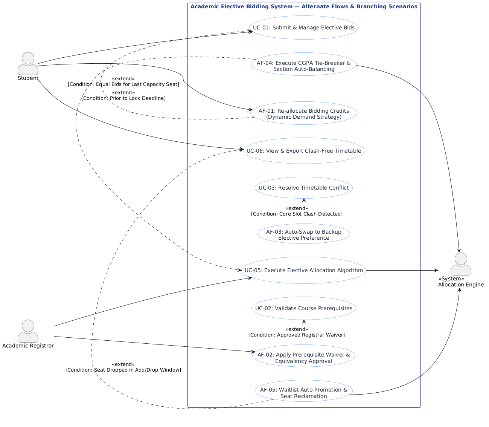

# Lab 1: Requirements Engineering & UML Use-Case Modelling
**Course:** PES University - Dept. of CSE  
**Name:** Shashank D  
**SRN:** PES1UG24CS433  

---

## Problem Statement #05 | Campus & Academic Operations
### **Academic Elective Bidding & Allocation System**

### **1. Problem Context & Overview**
University departments need an automated elective course selection mechanism where students allocate bidding credits across preferences and the engine solves allocation constraints while preventing timetable collisions.

**Target Stakeholders / Actors:** Student, Academic Registrar, Allocation Engine

---

## 1. Complete Requirements Table

| Req ID | Type | Description | Priority | Acceptance Criteria | Rationale (Short Justification) | Comments |
| :--- | :--- | :--- | :---: | :--- | :--- | :--- |
| **FR-001** | Functional | The system shall allow students to distribute 100 bidding credits across their ranked elective preferences and validate prerequisite course completions. | **High** | **Pass:** Credits deduct accurately (sum == 100) and prerequisites validated.<br>**Fail:** Total allocated credits != 100 or unmet prerequisites bypassed. | Core bidding functionality ensuring fair distribution of student preferences according to academic eligibility. | Base requirement from problem statement. |
| **FR-002** | Functional | The system shall allow the Academic Registrar to configure elective course offerings, section capacities (min/max seats), and designated timetable slot constraints. | **High** | **Pass:** Course records saved with designated capacities and slot times.<br>**Fail:** Duplicate slot assignments without multi-section flag or invalid seat caps. | Establishes the boundary conditions and constraints required by the automated allocation solver. | Validates non-negative seat counts and non-overlapping department slots. |
| **FR-003** | Functional | The system shall execute the multi-criteria optimization solver to allocate courses based on bid weightings, CGPA tie-breakers, and room/slot collision avoidance rules. | **High** | **Pass:** All eligible bids evaluated; seats filled up to max limit with 0 timetable clashes.<br>**Fail:** Student assigned to overlapping lecture slots or oversubscribed course. | Core algorithmic automation eliminating manual clash resolution and ensuring objective allocation. | Solver should handle hard constraints (no clash) and soft constraints (preferences). |
| **FR-004** | Functional | The system shall allow students to view real-time provisional seat demand percentages and adjust/reallocate their submitted bidding points prior to the deadline window closure. | **Medium** | **Pass:** Bid updates reflected instantly in student profile and draft pool before lock time.<br>**Fail:** Modifications permitted after deadline timestamp. | Provides transparency on course popularity, allowing students to strategize point allocation dynamically. | Access locked immediately upon bidding window expiry. |
| **FR-005** | Functional | The system shall publish final allocation results, generate individualized clash-free timetables for students, and export master enrollment rosters for the Academic Registrar. | **Medium** | **Pass:** Downloadable PDF/ICS schedule produced with 0 slot clashes; Registrar roster matches allocated student IDs.<br>**Fail:** Incomplete roster export or unassigned enrolled courses. | Closes the registration lifecycle with actionable student schedules and official registrar records. | Supports PDF and Excel/CSV export formats. |
| **NFR-001** | Non-Functional<br>*(Performance)* | The final elective allocation solver shall process 5,000 student bids and resolve schedule conflicts in under 30 seconds. | **High** | **Pass:** Benchmarking tests confirm execution time < 30 seconds for 5,000 concurrent student bids under simulated peak load.<br>**Fail:** Solver execution exceeds 30 seconds or server runs out of memory. | Prevents server bottlenecks and ensures rapid turnaround between bidding closure and timetable publishing. | Benchmark under synthetic 5,000 student dataset with 40 elective offerings. |
| **NFR-002** | Non-Functional<br>*(Security & Integrity)* | The system shall enforce Role-Based Access Control (RBAC) and maintain an immutable audit trail of all bid submissions, modifications, and administrative overrides. | **High** | **Pass:** Unauthorized role access blocked (403 Forbidden); 100% of bid modification events logged with timestamp, user ID, and prior state.<br>**Fail:** Unauthenticated bid injection or unlogged state change. | Guarantees academic integrity, prevents tampering, and ensures auditability during student grievance redressals. | Audit log entries secured with write-once access policies. |

---

## 2. Main UML Use-Case Diagram

### 2.1 Actors & Use Cases Overview

#### **Actors:**
1. **Student** (Primary Actor - Initiates bidding, manages preferences, views allocations)
2. **Academic Registrar** (Primary Actor - Configures courses, runs solver, reviews rosters, handles overrides)
3. **Allocation Engine** (Secondary / Supporting System - Executes constraint satisfaction algorithm)

#### **Use Cases:**
- **UC-01:** Submit & Manage Elective Bids
- **UC-02:** Validate Course Prerequisites (*«include»* in UC-01)
- **UC-03:** Resolve Timetable Conflict (*«extend»* to UC-01)
- **UC-04:** Configure Course Offerings & Capacities
- **UC-05:** Execute Elective Allocation Algorithm
- **UC-06:** View & Export Clash-Free Timetable
- **UC-07:** Apply Manual Allocation Override (*«extend»* to UC-05)

### 2.2 Main UML Use-Case Diagram


---

## 3. Main Use-Case Flow Specification

### **Use Case: UC-01 — Submit Elective Bids**

| Field | Specification |
| :--- | :--- |
| **Use Case ID** | **UC-01** |
| **Use Case Name** | Submit Elective Bids |
| **Primary Actor** | Student |
| **Secondary Actor(s)**| Academic Database / Prerequisite Validation Service |
| **Priority** | High |
| **Description** | Allows a student to allocate 100 bidding credits across their preferred elective courses, validate prerequisites, and lock their bidding submission for algorithmic allocation. |
| **Preconditions** | 1. Student is authenticated and has an active enrollment status.<br>2. Elective bidding window is active/open.<br>3. Student has exactly 100 unspent bidding points available for the semester. |
| **Postconditions** | 1. Student's elective bids and credit allocations are persistently stored.<br>2. Total credits used are marked as 100.<br>3. An immutable audit log entry and confirmation receipt are generated. |

#### **Main Success Scenario (Step-by-Step Flow):**
1. **Student** logs into the portal and navigates to the "Elective Course Bidding" section.
2. **System** displays the list of offered elective courses, descriptions, available seats, faculty, and schedule slot timings.
3. **Student** selects up to $N$ elective courses and distributes exactly 100 bidding points among them based on priority.
4. **Student** submits the bidding form by clicking "Submit Bids".
5. **System** invokes `«include»` **UC-02: Validate Course Prerequisites** to check completed credits and course history against prerequisites.
6. **System** validates that the sum of allocated bidding points is exactly equal to 100.
7. **System** confirms that no two selected electives share mutually exclusive required core slots.
8. **System** commits the bid records into the active allocation pool and generates a transaction timestamp.
9. **System** displays a success message and summary receipt.
10. **Use Case ends successfully.**

---

## 4. Alternate Flow Use-Case Diagram & Specifications

### 4.1 Alternate Flow Use-Case Diagram



### 4.2 Alternate Flow Specifications

- **AF-01: Re-allocate Bidding Credits (Dynamic Demand Strategy - `«extend»` UC-01)**
  - *Condition:* Prior to Bidding Deadline Closure.
  - *Flow:* Student reviews dynamic seat popularity metrics; adjusts points across draft electives to maximize allocation likelihood; saves updated 100-credit distribution.
- **AF-02: Apply Prerequisite Waiver & Equivalency Approval (`«extend»` UC-02)**
  - *Condition:* Registrar Waiver Granted for Course Prerequisites.
  - *Flow:* Student lacks standard prerequisite but presents signed registrar waiver token; system bypasses standard check and approves bid submission.
- **AF-03: Auto-Swap to Backup Elective Preference (`«extend»` UC-03)**
  - *Condition:* Primary Elective Timetable Clash Detected.
  - *Flow:* When top-ranked preference conflicts with core slot, engine automatically shifts evaluation to pre-ranked secondary backup course without terminating submission.
- **AF-04: Execute CGPA Tie-Breaker & Section Auto-Balancing (`«extend»` UC-05)**
  - *Condition:* Equal Bid Points for Final Capacity Seat.
  - *Flow:* Solver breaks point ties using Cumulative GPA and prerequisite grade index, assigning tied student to parallel open section slot.
- **AF-05: Waitlist Auto-Promotion & Seat Reclamation (`«extend»` UC-06)**
  - *Condition:* Seat Vacated during Add/Drop Window.
  - *Flow:* Engine reclaims vacated seat and automatically promotes highest waitlisted student, updating timetable and dispatching notification.

---

## 5. Exception Flow Specification Document

### 5.1 Exception Flow Summary Matrix

| Exception ID | Target Use Case | Exception Title | Error Category | Severity | Detection Trigger & System Response |
| :--- | :--- | :--- | :--- | :---: | :--- |
| **EF-01** | UC-01 | Credit Sum Mismatch ($\neq 100$) | Data Validation | High | Form sum $\neq 100$. System halts commit, displays dynamic point counter, and highlights input fields. |
| **EF-02** | UC-01 / UC-02 | Unmet Course Prerequisite | Domain Rule | High | Prerequisite record missing. System rejects line-item bid, flags gap, and prompts course swap/waiver. |
| **EF-03** | UC-01 / UC-03 | Unresolvable Slot Collision | Hard Constraint | High | Preference overlaps core slots. System rejects matrix and prompts non-conflicting bucket selection. |
| **EF-04** | UC-01 | Bidding Window Expiry Lockout | Temporal / State | Critical | Timestamp $> T_{\text{deadline}}$. System aborts transaction, enforces READ_ONLY state, and preserves prior state. |
| **EF-05** | UC-05 | Solver Convergence / Timeout | Performance | Critical | Execution $> 30$s limit. Watchdog kills process, rolls back DB checkpoint, and alerts Registrar. |
| **EF-06** | UC-01 / UC-05 | DB Concurrency Deadlock | Infrastructure | High | DB lock failure (`SQLSTATE 40P01`). System triggers idempotent retries and enqueues requests. |
| **EF-07** | UC-07 | Unauthorized Override Breach | Security / RBAC | Critical | Missing `ROLE_REGISTRAR`. System returns 403 Forbidden, logs immutable audit entry, and flags origin IP. |

---

## 6. Deliverable Artifacts Directory Structure

```
.
├── Deliverable_1_Requirements_Table.pdf
├── Deliverable_2_Use_Case_Diagram.pdf
├── Deliverable_3_Use_Case_Flow_Specification.pdf
├── Deliverable_4_Alternate_Flow_Use_Case_Diagram.pdf
├── Deliverable_5_Exception_Flow_Specification.pdf
├── Complete_Lab1_Deliverables_Report.pdf
├── README.md
├── index.html
├── exception_flow_document.md
├── use_case_diagram.puml
├── use_case_diagram.png
├── alternate_flow_use_case_diagram.puml
└── alternate_flow_use_case_diagram.png
```
